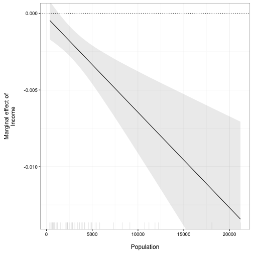
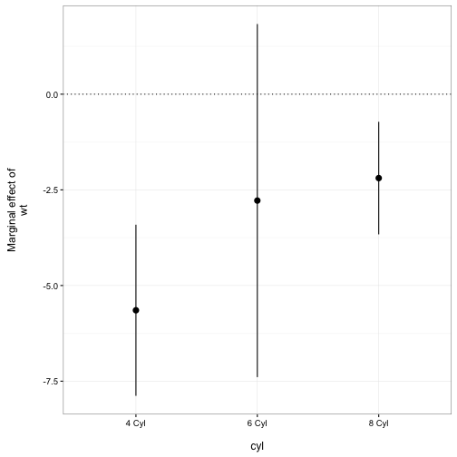

plotMElm
======================

A simple R package to plot marginal effects from interactions estimated
from linear models.

[](https://travis-ci.org/christophergandrud/plotMElm) [](http://cran.r-project.org/package=plotMElm)  

# Examples

## Continuous Term 2

The package contains one simply function: `plot_me` for plotting marginal
effects from interactions estimated from models estimated with the
`lm` function in base R. For example, when the second term is continuous:


```r
# Load package
library(plotMElm)

# Estimate model
states <- as.data.frame(state.x77)
m1 <- lm(Murder ~ Income * Population, data = states)

# Plot marginal effect of Income across the observed range of Population
plot_me(m1, 'Income', 'Population')
```



## Categorical (Factor) Term 2

When the second term in the interaction is a categorical (factor) variable then point-ranges are plotted. Note that the marginal effect is in terms of the 
reference category:


```r
# Set Term 2 as a factor variable
mtcars$cyl <- factor(mtcars$cyl, 
                     labels = c('4 Cyl', '6 Cyl', '8 Cyl'))

# Estimate model
m2 <- lm(mpg ~ wt * cyl, data = mtcars)

# Plot marginal effect of Weight across the Number of Cylinders
plot_me(m2, 'wt', 'cyl')
```



Note that point ranges will also be used if there are five or fewer fitted values.

## See also 

The [interplot](https://cran.r-project.org/package=interplot) package also has many of the same capabilities as *plotMElm*.

