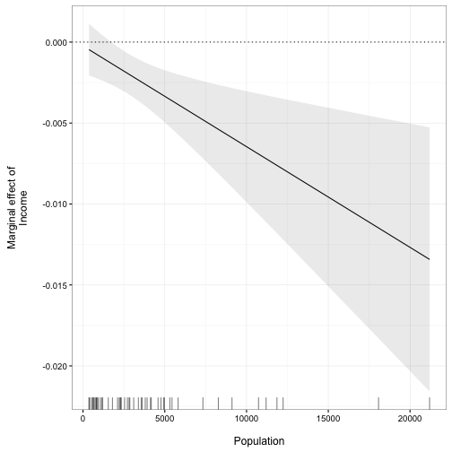

plotMElm
======================

A simple R package to plot marginal effects from interactions estimated
from linear models.

# Example

The package contains one simply function: `plot_me` for plotting marginal
effects from interactions estimated from models estimated with the
`lm` function in base R. For example:


```r
# Load package
library(plotMElm)

# Estimate model
states <- as.data.frame(state.x77)
m1 <- lm(Murder ~ Income * Population, 
         data = states)

# Plot marginal effect of Income across the observed range of Population
plot_me(m1, 'Income', 'Population')
```


