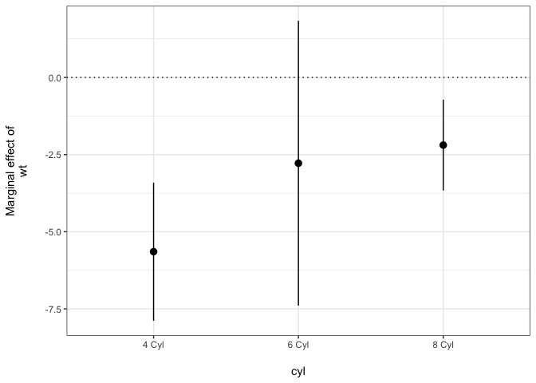
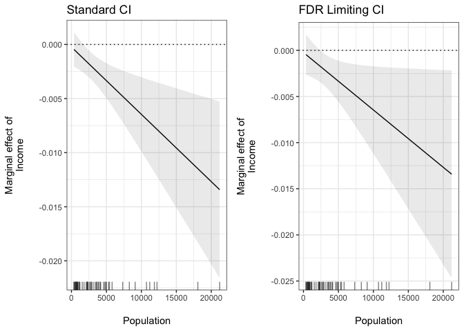

# plotMElm

A simple R package to plot marginal effects from interactions estimated
from linear models.

[](https://travis-ci.org/christophergandrud/plotMElm)
[](http://cran.r-project.org/package=plotMElm)

<!----
 
--->

# Examples

## Continuous Term 2

The package contains one simply function: `plot_me` for plotting
marginal effects from interactions estimated from models estimated with
the `lm` function in base R. For example, when the second term is
continuous:

``` r
# Load package
library(plotMElm)

# Estimate model
states <- as.data.frame(state.x77)
m1 <- lm(Murder ~ Income * Population, data = states)

# Plot marginal effect of Income across the observed range of Population
plot_me(m1, 'Income', 'Population')
```

<!-- -->

\#\# Categorical (Factor) Term 2

When the second term in the interaction is a categorical (factor)
variable then point-ranges are plotted. Note that the marginal effect is
in terms of the reference category:

``` r
# Set Term 2 as a factor variable
mtcars$cyl <- factor(mtcars$cyl, 
                     labels = c('4 Cyl', '6 Cyl', '8 Cyl'))

# Estimate model
m2 <- lm(mpg ~ wt * cyl, data = mtcars)

# Plot marginal effect of Weight across the Number of Cylinders
plot_me(m2, 'wt', 'cyl')
```

<!-- -->

Note that point ranges will also be used if there are five or fewer
fitted values.

## Determining the False Positive Rate

[Esarey and
Sumner](http://jee3.web.rice.edu/interaction-overconfidence.pdf) show
that pointwise confidence intervals from marginal effect plots produce
statistically significant findings at a rate that can be larger or
smaller than is warrented. `plot_me` allows users to specify `ci_type =
'fdr'` to find confidence intervals that correct for overly confident
marginal effects in the face of multiple comparisons. FDR stands for
“False Discovery Rate”. For example:

``` r
# Plot marginal effect of Income across the observed range of Population
# with false discovery rate limited confidence intervals
plot_me(m1, 'Income', 'Population', ci_type = 'fdr')
```

Here is the result compared with standard confidence intervals:

    ## t-statistic used: 2.269

<!-- -->

You can also use the `t_statistic` argument to supply custom
t-statistics for creating the marginal effect confidence intervals. This
is useful if you want to use a funciton like `findMultiLims` from the
[interactTest](https://cran.r-project.org/package=interactionTest)
package to find t-statistics that can be used to correct confidence
intervals for underconfidence.

## See also

The [interplot](https://cran.r-project.org/package=interplot) package
also has some of the same capabilities as **plotMElm**.
